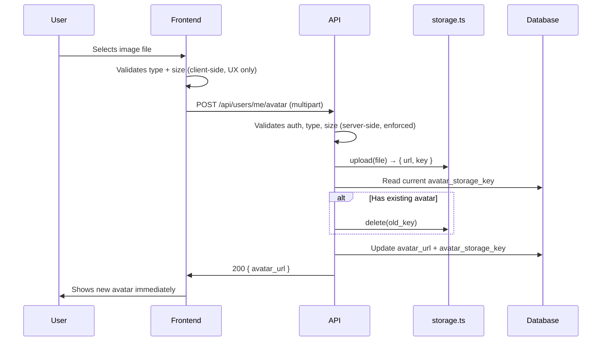

# User Avatar Upload Spec

## TL;DR

- Users can upload a JPEG or PNG profile picture (max 5 MB); stored via the existing `storage` service to S3.
- The old avatar file must be deleted from S3 when replaced — failing to do so orphans files silently (AC-5).

---

## Acceptance Criteria

| AC | Criterion |
| -- | --------- |
| 1  | A user can upload a JPEG or PNG file as their avatar from the account settings page |
| 2  | Files larger than 5 MB are rejected before upload with a clear error message |
| 3  | Files of any type other than JPEG or PNG are rejected before upload with a clear error message |
| 4  | On successful upload, the new avatar is immediately visible on the user's profile and in the nav bar |
| 5  | When a user replaces an existing avatar, the previous file is deleted from S3 |
| 6  | Users who have never uploaded an avatar see their initials on a colored background in all avatar positions |
| 7  | The upload request is authenticated — unauthenticated requests are rejected with 401 |
| 8  | The global upload size limit in config is raised to at least 5 MB to allow avatar uploads |

---

## Avatar Upload

### Fields

| Field | Type | Constraint | Notes |
| ----- | ---- | ---------- | ----- |
| `avatar_url` | string \| null | nullable | Public URL returned by the storage service; stored on `users` table |
| `avatar_storage_key` | string \| null | nullable | Internal S3 key used to delete the old file; stored on `users` table — **must be added via migration** |

### Behavior

- **Accepted types**: JPEG (`image/jpeg`) and PNG (`image/png`) only — validated server-side, not just by file extension. — AC-3
- **Size limit**: 5 MB maximum, validated before the file reaches S3. — AC-2
- **Storage**: all file I/O goes through `src/services/storage.ts` — do not call S3 directly. — AC-1, AC-5
- **Deletion on replace**: before saving a new avatar, read the current `avatar_storage_key` from the user record and delete that key via the storage service. If no key exists (first upload), skip deletion. — AC-5
- **Default avatar**: when `avatar_url` is null, render initials using the first letter of `first_name` and `last_name`, on a deterministic background color derived from the user's id. — AC-6

### Flow

### Watch out for

- **Global upload limit**: `config/uploads.ts` sets a 2 MB global limit. A 5 MB avatar upload will be rejected by the middleware before it reaches the avatar handler. Raise this limit to at least 5 MB (AC-8) — or scope a higher limit to the avatar endpoint only to avoid loosening the limit globally.
- **`avatar_storage_key` column**: this column does not exist yet on the `users` table. A migration is required before the endpoint can store or read it. Without it, the old file can never be deleted (AC-5 will fail silently).

---

## UI Changes

### Account Settings — Avatar
**URL:** [https://example.com/settings/profile](https://example.com/settings/profile)

> **[Screenshot needed]:** Current profile settings page. Annotate: (1) add avatar preview circle (80 px) showing current avatar or initials fallback, (2) add "Upload photo" button below the circle, (3) add helper text "JPEG or PNG, max 5 MB"

#### Changes

- Add avatar preview (80 px circle) with initials fallback
- Add "Upload photo" button that opens a file picker filtered to `.jpg,.jpeg,.png`
- Add helper text: "JPEG or PNG, max 5 MB"
- Show an inline error on rejected files (wrong type or too large)
- Show a loading spinner during upload; replace with new avatar on success

### Nav Bar
**URL:** All pages

> **[Screenshot needed]:** Current nav bar. Annotate: (1) replace placeholder user icon with avatar circle (32 px), showing initials fallback when no avatar set

---

## Data Migration

Add `avatar_storage_key VARCHAR(512) NULL` to the `users` table. All existing rows default to `NULL` (no avatar). No backfill needed.

---

## Boundaries

- **`storage.ts` is the only S3 interface**: do not import the AWS SDK or call S3 directly — all storage operations go through `src/services/storage.ts`.
- **Do not change other upload endpoints**: only the avatar endpoint gets the raised size limit; do not alter limits for document or attachment uploads.
- **Do not touch the `auth` middleware**: the avatar endpoint reuses existing auth middleware as-is.

---

## Checklist

**API — `src/routes/users/`**
- [ ] Add `POST /api/users/me/avatar` route with auth middleware — AC-1, AC-7
- [ ] Validate MIME type and file size server-side — AC-2, AC-3
- [ ] Call `storage.ts` upload, then delete old key if present, then update DB — AC-4, AC-5

**Database — `src/models/`**
- [ ] Migration: add `avatar_storage_key` column to `users` — AC-5
- [ ] Update `User` model to include `avatar_storage_key` — AC-5

**Config — `config/uploads.ts`**
- [ ] Raise global (or avatar-scoped) upload limit to ≥ 5 MB — AC-8

**Frontend — `src/components/`**
- [ ] Avatar component: circle crop, initials fallback, deterministic color — AC-6
- [ ] Settings page: file picker, upload handler, error/loading states — AC-1, AC-2, AC-3
- [ ] Nav bar: swap placeholder icon with Avatar component — AC-4, AC-6
